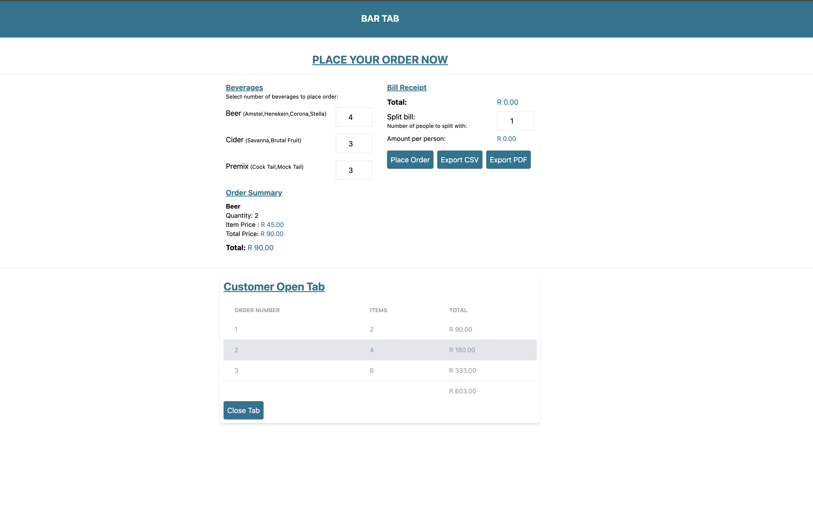

# Bar Tap

## Overview

This is a simple web app that allows users to order beverages, split the bill, and export the tab as CSV or PDF.

## Tech Stack

- Vue.js 3
- Pinia (for state management)
- No backend, all data is handled in-memory

## Installation

1. Clone the repository.
2. Navigate to the project directory.
3. Install dependencies:
   npm install

4. Run the application:

## Usage

1. Select the quantity of beverages you want to order.
2. Optionally, enter the number of people to split the bill.
3. View your order summary and the total cost.
4. Submit the order
5. After submitting the order Customer tab will show (you can add more order if you want)
6. Export your order as CSV or PDF.

## Components

- **BeverageList**: List of available beverages.
- **BeverageItem**: A single beverage with input for quantity.
- **OrderSummary**: Displays the current order and total.
- **Bill**: Optional bill splitting.
- **ExportButton**: Export order to CSV/PDF.

## Notes

- This application does not include a persistence layer.
- The app is designed to be lightweight and simple for demonstration purposes.

## Screen Shots

